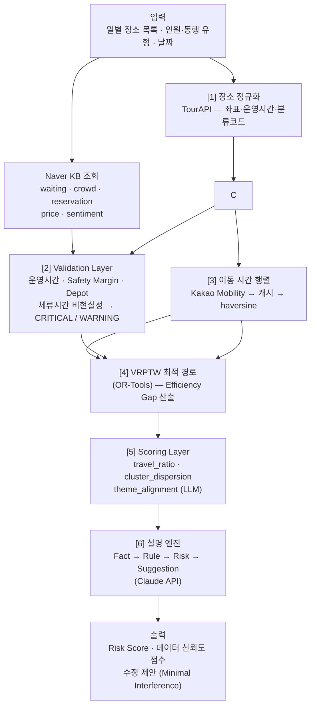

<!-- updated: 2026-05-02 | hash: cb5ae6e6 | summary: 입력 스키마 확정 — 다일 일정(DayPlan), 인원·동행 유형, 체류시간 자동 추정 반영 -->

# 관광 일정 QA 엔진 — Explainable Travel Plan Validator

> 여행 일정을 **생성**하는 AI가 아니라, 생성된 일정의 실행 가능성과 비효율을 **설명 가능하게 검증**하는 관광 일정 QA 엔진

---

## 문제 정의

기존 여행 추천 서비스는 일정 생성에는 강점을 가진다.  
그러나 생성된 일정이 실제로 실행 가능한지, 효율적인지를 **정량적으로 검증**하는 기능은 부재한다.

대표적인 문제:

- 이동 시간이 전체 일정의 절반을 차지하는 과이동 일정
- 현실적으로 수행하기 어려운 과밀 일정
- 지리적으로 분산된 비효율 동선
- 운영시간 근접 도착으로 인한 관람 불가 리스크

**본 시스템은 이를 측정 가능한 데이터로 정량화하고, 근거 기반 개선안을 제시한다.**

---

## 실증 분석 결과 — 두 데이터셋 기반 Baseline

### 분석 대상

| 데이터셋 | 출처 | 경로 수 | 분석 일정일 |
|---------|------|---------|------------|
| **대한민국 구석구석** | 한국관광공사 공식 추천 (공공 데이터) | 50개 | 101일 |
| **트리플 앱** | 상업 여행 앱 추천 (대한민국 경로 한정) | 38개 | 93일 (유효 89일\*) |

> \* 트리플 앱은 현지 카페·식당을 다수 포함하나, Kakao Local API 도입 후 지오코딩 성공률 96.6% (유효 travel_ratio 산출: 95.7%)

---

### 핵심 비교 지표

| 지표 | 구석구석 | 트리플 (유효일 기준) |
|------|---------|------------------|
| 이동 비율 평균 | **0.157** | 0.143 |
| 이동 비율 중앙값 | 0.081 | 0.129 |
| 경고(≥20%) 비율 | **16.8%** | 9.0% |
| 위험(≥40%) 비율 | **11.9%** | 3.4% |
| 최악 사례 | 0.86 (대구 1박2일) | 0.607 (경주 당일치기) |
| 지오코딩 성공률 | **95.6%** | **96.6%** |
| 평균 지리 분산 | **36.3km** | 21.5km |
| 백트래킹 발생률 | **44.6%** | 32.3% |
| 12h 초과 일정 | **9일** | 6일 |

### 인사이트

**구석구석 (공공 추천):**
- 공식 추천임에도 16.8%가 경고, 11.9%가 위험 수준 — **검증 레이어 필요성 입증**
- 이동 비율 최대 0.86 (하루 일정의 86%가 이동), 총 일정 시간 최대 35.8시간
- 광역 이탈(>50km) 일정 17건 — 같은 날 먼 도시 장소 혼합 배치가 원인
- 백트래킹(되돌아가기) 44.6% 발생

**트리플 앱 (상업 추천):**
- 지오코딩 성공률 96.6% (Kakao Local API 도입 후) — travel_ratio 89/93일(95.7%) 산출
- 이동 비율 평균 0.143 · 경고 9.0% · 위험 3.4% — 구석구석 대비 절반 수준
- 도시 내 집중형이나 최대 직선거리 평균 21.5km, 백트래킹 32.3%로 문제 존재
- **"검증 가능성"이 추천 품질의 또 다른 축**임을 시사

---

## VRPTW 기반 QA 방법론

### 적용 타당성 판단 — 실증 데이터 근거

VRPTW(Vehicle Routing Problem with Time Windows)를 AI 추천 경로의 품질 평가에 적용할 수 있는지를 두 데이터셋(n=194일)으로 검증했다.

#### 핵심 수치

| 지표 | 구석구석 (n=101일) | 트리플 (n=93일) |
|------|-------------------|----------------|
| **VRPTW 개선 가능 케이스** (백트래킹 또는 이동비율 ≥0.2) | **55.4%** (56/101) | **43.0%** (40/93) |
| 백트래킹 발생률 | 44.6% (45일) | 32.3% (30일) |
| 이동비율 경고 (≥0.2) | 16.8% | 12.4% |
| 평균 POI 수 | **4.3개** (max 6) | — |
| 지역 전환 발생 | 89.1% | 92.5% |
| 최대 지리 분산 | 309.4km | 300.6km |

#### 결론: 적용 타당

**개선 근거:**
- 두 데이터셋 모두 40~55%의 일정이 순서 최적화 여지를 가짐
- POI 수 평균 4.3개(max 6) → OR-Tools로 밀리초 수준 최적해 계산 가능, NP-hard 복잡도 문제 없음
- 운영시간(Time Window) 고려 없이 생성된 AI 추천이 대부분 → VRPTW는 이를 제약으로 명시적으로 처리함

**한계 (VRPTW만으로 해결 불가한 케이스):**
- 광역 분산(>50km) 일정: 구석구석 16.8%, 트리플 5.4% → 순서 변경이 아닌 "장소 교체·제거" 필요
- 백트래킹이 있어도 travel_ratio가 낮은 경우 존재 (콤팩트한 지역 내 왕복) → VRPTW 개선폭이 미미할 수 있음

#### 설계 철학 — 벤치마크로서의 최적 경로

VRPTW가 산출하는 최적 경로는 사용자에게 강요하는 **'정답'이 아니라 기회비용 벤치마크**다.

시스템은 사용자의 비효율을 단순히 지적하지 않는다.  
최적 경로 대비 추가되는 이동 시간과 거리를 **데이터 증거(Evidence)로 제시**하여,  
사용자가 *"이 장소를 위해 이만큼의 이동 시간을 감수할 가치가 있는지"* 스스로 판단할 수 있는 정보를 제공하는 데 집중한다.

```
사용자 일정: A → D → B → C  (이동 220분)
최적 순서:   A → B → C → D  (이동 140분)
──────────────────────────────────────────
벤치마크 제시: "현재 순서는 최적 대비 80분 추가 소요됩니다.
               D를 마지막으로 미룰 경우 이동 36% 단축 가능합니다."
판단은 사용자에게: D에 특별한 이유(예약 시간, 동반자 요청)가 있다면 현행 유지 선택 가능
```

---

### QA 파이프라인: VRPTW + 휴리스틱

단순 "최적 순서 찾기"를 넘어, **AI가 생성한 순서와 수학적 최적 순서를 대조**해 품질을 정량 평가한다.

```
[입력] AI 추천 경로 (장소 순서, 좌표, 운영시간)
          ↓
[Step 1] TimeMatrix 구성
          ├─ cache_route.json 존재 → Kakao 실주행 시간 사용
          └─ 없음 → Haversine 30km/h 폴백
          ↓
[Step 2] 시계열 시뮬레이션 (사용자 순서 그대로)
          ├─ Time Window 위반 탐지 → CRITICAL
          ├─ Safety Margin 위반 (종료 60분 이내 도착) → CRITICAL
          └─ 피로도 계산 (총 일정 > 12시간) → WARNING
          ↓
[Step 3] VRPTW 최적 순서 계산 (OR-Tools)
          ├─ 목표: 최소 이동 시간
          ├─ 제약: Time Window + 대기 허용(Slack)
          └─ Depot 고정: 2박3일 이상은 숙소 출발/귀환 강제
          ↓
[Step 4] Efficiency Gap 계산
          = (사용자 경로 시간 - 최적 경로 시간) / 최적 경로 시간
          ≥ 20% → "효율성 낮음" WARNING
          ↓
[Step 5] Risk Score 산출 (100점 만점)
          - CRITICAL 이슈 당 -15점
          - WARNING 이슈 당 -5점
          - Efficiency Gap 초과분 추가 감점
          - 피로 시간당 -10점 (12시간 초과분)
          ↓
[출력] VRPTWResult
    • risk_score + PASS/FAIL (기준: 60점)
    • 사용자 순서 vs 최적 순서 비교표 (일별)
    • Deep Dive: Fact · Rule · Risk · Suggestion
```

#### Risk Score 채점 기준 (Validation Layer)

| 항목 | 감점 | 판정 기준 |
|------|------|----------|
| Time Window 위반 | -15점/건 | CRITICAL |
| Safety Margin (종료 60분 이내) | -15점/건 | CRITICAL |
| Depot 제약 미준수 | -15점/건 | CRITICAL |
| 체류시간 비현실성 (권장 50% 미만) | -5점/건 | WARNING |
| Efficiency Gap > 20% | -5점 + 초과분 보정 | WARNING |
| 피로도 (12시간 초과) | -10점/시간 | WARNING |
| PASS 기준 | 60점 이상 | — |

#### Fact-Rule-Risk-Suggestion 출력 예시

```
Fact       '남대문시장' 도착 예정 17:42, 영업 종료 18:00 — 18분 여유
Rule       safety_margin: 종료 60분 이내 도착
Risk       CRITICAL — 60분 미만 여유 시 관람 불가 리스크
Suggestion '남대문시장'을 일정 앞부분으로 이동하거나 이전 장소 체류시간을 단축하세요.

Fact       사용자 이동시간 5,400초 vs 최적 3,200초 (Efficiency Gap 68.8%)
Rule       efficiency_gap: 최적 대비 20% 초과
Risk       WARNING — 방문 순서 비효율
Suggestion VRPTW 최적 순서: A → C → B → D 로 재배치 시 이동 37분 절감
```

---

## 서비스 포지셔닝

| 구분 | 내용 |
|------|------|
| **B2G** | 지자체·한국관광공사가 추천 코스의 실행 가능성을 정량 점검 |
| **B2B** | 여행 앱·플랫폼이 추천 결과 배포 전 품질을 자동 검사 |
| **핵심 가치** | 관광 경험 실패 감소 · 추천 시스템 벤치마크 제공 · 과밀·비효율 코스 개선 |

---

## 시스템 구조



---

## 스코어 구조

리스크 점수는 **두 레이어 × 항목별 패널티**로 구성된다.

### Validation Layer (VRPTW) — 실행 가능성

| 항목 | 측정 대상 | 등급 |
|------|----------|------|
| Time Window 위반 | 도착 시간 vs 운영시간 | CRITICAL |
| Safety Margin | 종료 60분 이내 도착 | CRITICAL |
| Depot 제약 | 2박3일+ 숙소 출발/귀환 | CRITICAL |
| 체류시간 비현실성 | 입력 체류시간 < 권장 50% | WARNING |
| 피로도 | 총 일정 12시간 초과 | WARNING |
| 순서 효율성 (백트래킹) | 비효율적 이동 패턴 | WARNING |

### Scoring Layer — 일정 품질

| 항목 | 측정 대상 | 패널티 |
|------|----------|--------|
| Travel Ratio | 이동 시간 비율 | 0 / -5 / -10 / -20 |
| Cluster Dispersion | 하루 내 지리 분산 | 0 ~ -20 (캡) |
| Theme Alignment (LLM) | 테마 vs 장소 일치도 | 0 / -5 / -10 / -20 |

### 통합 Risk Score 공식

```
final_risk_score = 100
    - VRPTW CRITICAL × 15
    - VRPTW WARNING  × 5
    - travel_ratio_penalty      (0 / -5 / -10 / -20)
    - cluster_dispersion_penalty (0 ~ -20, 캡 적용)
    - theme_mismatch_penalty    (0 / -5 / -10 / -20, LLM)

CRITICAL 1건이라도 존재 → final ≤ 59 (FAIL)
```

---

## 패널티 항목 상세

### 1. Travel Ratio (이동 효율성)

이동 시간 ÷ 전체 일정 시간

**기준 산출 — 3단계 보정 구조:**

| 단계 | 방법 |
|------|------|
| 1차 초기값 | 구석구석 101일 + 트리플 유효 18일 기반 threshold 설정 |
| 2차 보정 | 실제 사용자 동선·리뷰 기반 calibration |
| 3차 검증 | Synthetic bad schedule + human evaluation |

**1차 초기값 기준 (구석구석 n=101, 트리플 n=89 합산):**

| 구간 | 패널티 | 근거 |
|------|--------|------|
| 0.20 ~ 0.40 | -5 | 구석구석 P90=0.50, 전체 경고 16.8% |
| 0.40 ~ 0.60 | -10 | 구석구석 위험 사례 집중 구간 |
| 0.60 이상 | -20 | 구석구석 최악 사례 0.86 |

> 구석구석 실측: 평균 0.157, 중앙값 0.081, P75=0.136, P90=0.505 (n=101)  
> 트리플 실측: 평균 0.143, 중앙값 0.129, P90=0.210 (n=89)

---

### 2. Total Duration (시간 현실성)

이동 시간 + 체류 시간의 합

**체류 시간 추정 — 구간값 + 신뢰도:**

| 장소 유형 | 체류 시간 구간 | 신뢰도 |
|-----------|--------------|--------|
| 카페·식당 | 45 ~ 75분 | 중 |
| 일반 관광지 | 75 ~ 120분 | 중 |
| 전시·박물관 | 90 ~ 150분 | 중하 |

출력 예: `예상 총 일정시간 10.5 ~ 12.0시간 (신뢰도: 중)`

패널티 기준:

| 구간 | 패널티 | 근거 |
|------|--------|------|
| 10 ~ 12시간 | -5 | 구석구석 12h 초과 9건/101일 (8.9%) |
| 12 ~ 14시간 | -10 | 트리플 12h 초과 3건/93일 (3.2%) |
| 14시간 이상 | -20 | 구석구석 최대 35.8시간 (이상치 포함) |

---

### 3. Backtracking (순서 효율성)

**정의:** 방문 순서 상의 재방문·되돌아감 *(≠ 공간 분산)*  
연속된 이동 경로에서 동일 지역 재진입 횟수를 측정한다.

> 구석구석 실측: 44.6% 발생 / 트리플 실측: 32.3% (89일 중 30일 — 도시 내에서도 재진입 발생)

| 발생 횟수 | 패널티 |
|-----------|--------|
| 1회 | -5 |
| 2회 이상 | -10 |

---

### 4. Cluster Dispersion (공간 응집도)

**정의:** 하루 일정의 전체 공간 분산도 *(per-day 기준, 일 간 거리는 패널티 없음)*

4~8개 장소의 표본 규모를 감안해 K-means 대신 **시군구 전환 수 + Haversine 최대 직선거리** 두 메트릭으로 측정한다.

> 구석구석 실측: 평균 36.3km, P90=157km, 17건 50km 초과  
> 트리플 실측: 평균 21.5km, 중앙값 12.3km — 도시 집중형이나 최대 300km 이상 이상치 존재

**메트릭 1: 비연속 구역 재진입 — 백트래킹 (per-day)**

이미 방문한 시군구에 다른 지역을 거쳐 돌아오는 횟수. 순방향 다구역 순회와 구별됨.

| 재진입 횟수 | 패널티 |
|------------|--------|
| 0회 | 0 (정상) |
| 1회 | -5 |
| 2회 이상 | -10 |

> 예: 강남→홍대→강남 = 1회(WARNING) / 강남→이태원→명동→종로 = 0회(정상)

**메트릭 2: 시군구 전환 횟수 (per-day)**

| 횟수 | 패널티 |
|------|--------|
| 0~2회 | 0 (정상) |
| 3회 | -5 |
| 4회 이상 | -10 |

**메트릭 3: 최대 직선거리 (per-day, Haversine)**

| 거리 | 패널티 |
|------|--------|
| < 30km | 0 (도시 내 정상 이동) |
| 30~50km | -5 (경고) |
| 50~100km | -10 (위험) |
| ≥ 100km | -20 (광역 이탈) |

**메트릭 4: 지리 클러스터 재진입 — DBSCAN (per-day)**

메트릭 1(시군구 기반)을 보완한다. 경주·제주처럼 행정구역이 넓은 곳에서는 같은 시군구 안에서도 지리적으로 멀리 떨어진 장소를 왕복하는 패턴이 발생한다. DBSCAN(eps=2km, haversine)으로 지리 클러스터를 즉석에서 계산해 비연속 재진입을 탐지한다.

> 예: 첨성대(경주 시내) → 감포해수욕장(동해안 28km) → 안압지(경주 시내 재진입) = 1회  
> sklearn 미설치 시 자동 스킵 (graceful fallback). per-request 계산 4~8 POI 기준 <1ms.

- M1과 같은 이벤트를 중복 탐지했을 경우 `net = max(0, M4_count - M1_count)` 으로 순증분만 패널티 부과.

| 재진입 횟수 (순증분) | 패널티 |
|---------------------|--------|
| 0회 | 0 |
| 1회 | -5 |
| 2회 이상 | -10 |

**중복 방지 캡:**  
네 메트릭 동시 위반 시 합산 최대 **-20** 캡 적용 (같은 원인에 대한 이중 패널티 방지).

---

### 5. Opening Hour Risk (운영 안전성)

도착 예정 시간과 운영 종료 시간 간의 차이를 기준으로 패널티를 적용한다.

| 구간 | 패널티 |
|------|--------|
| 종료 60분 이내 도착 | -5 |
| 종료 30분 이내 도착 | -10 |

**데이터 신뢰도 처리:**

| 데이터 상태 | 처리 방식 |
|------------|-----------|
| 운영시간 정상 제공 | 정상 평가 |
| 운영시간 누락 | 패널티 제외 + "정보 부족 경고" 출력 |
| 운영시간 비정형·불완전 | 낮은 신뢰도로 평가 + 경고 출력 |

---

### 6. Dwell Time Estimation (체류시간 자동 추정)

**정의:** 사용자가 체류시간을 입력하지 않으므로, dwell_db에서 장소 유형별 권장 체류시간을 자동 추정해 파이프라인에 주입한다.

**5단계 폴백 우선순위:**

| 우선순위 | 데이터 | 예시 |
|---------|--------|------|
| 1 | 수동 오버라이드 (주요 50~100개 POI) | `"경복궁": (90, 150)` |
| 2 | lclsSystm 3-depth 분류 | `"NA0410": (120, 240)` (산) |
| 3 | lclsSystm 1-depth 분류 | `"NA": (90, 180)` (자연) |
| 4 | contentTypeId (12=관광지 등) | `12: (60, 120)` |
| 5 | 기본값 | `(60, 120)` |

권장 범위의 **50% 미만** 입력 시 WARNING (−5점/건), DeepDive 항목 생성.

---

### 7. Theme Alignment (테마 일치성) — Scoring Layer (LLM)

**정의:** 사용자 선택 테마(장소 유형 9개 + 여행 스타일 9개)와 실제 일정 장소가 의미적으로 일치하는지 Claude AI 판정.

**패널티 표:**

| 일치도 | 패널티 |
|--------|--------|
| ≥ 0.8 | 0 (양호) |
| 0.6 ~ 0.8 | -5 (경고) |
| 0.4 ~ 0.6 | -10 (불일치) |
| < 0.4 | -20 (심각) |

**비용 관리:**
- System prompt Prompt Caching 적용 (`cache_control: ephemeral`)
- API 키 누락 또는 timeout(10초) 초과 시 → 패널티 스킵 + 정보성 DeepDive 출력
- (테마 + 정렬된 장소명) MD5 기준 메모리 캐시

---

## 데이터 신뢰도 점수

리스크 점수와 별도로 **데이터 신뢰도 점수(0~100)**를 함께 출력한다.

신뢰도에 영향을 주는 요인:

- 운영시간 데이터 누락 여부
- TourAPI + Kakao Local 지오코딩 성공률 (구석구석 95.6% / 트리플 96.6%)
- 체류시간 추정값 사용 여부
- Kakao API fallback 발생 여부

### 데이터 신뢰도 등급 (3단계)

| 등급 | 조건 | 신뢰도 영향 |
|------|------|------------|
| **High** | Kakao Mobility 실시간 API 성공 + TourAPI 운영시간 정상 | 패널티 정상 계산, 추정 없음 |
| **Medium** | 캐시 경로 사용 또는 dwell_db 추정값 적용 | −10~20점, 결과에 "(추정)" 표시 |
| **Low** | Haversine 폴백 또는 지오코딩 실패 | −30점 이상, 경고 메시지 출력 |

출력 예:
```
종합 Risk Score : 68 / 100
데이터 신뢰도  : 72 / 100  ← 운영시간 2건 누락 [Medium], 이동시간 1건 haversine [Low]
```

---

## 설명 가능한 분석 구조

모든 패널티는 다음 4단계로 설명된다.

| 단계 | 내용 |
|------|------|
| **Fact** | 데이터 기반 수치 사실 |
| **Rule** | 적용된 기준 및 threshold |
| **Risk** | 판정 결과 및 패널티 |
| **Suggestion** | 구체적 개선 제안 |

**예시:**

```
Fact       총 이동시간 220분 / 총 일정 480분 → Travel Ratio 0.46
Rule       Travel Ratio 0.40 이상 시 이동 과다 (-10)
Risk       이동 효율성 패널티 적용 — 구석구석 위험 사례 평균과 유사
Suggestion 3번 장소(남대문시장)를 2번(명동) 인접 배치 시 이동 40분 단축 가능
```

---

## 수정 전략 — 최소 간섭 원칙 (Minimal Interference)

수정 제안 시 **사용자가 선택한 장소 목록을 최대한 유지**하는 것을 최우선으로 한다.  
사용자의 선택에는 데이터로 포착되지 않는 의도(동반자 선호, 추억, 예약 등)가 담겨 있을 수 있다.

### 수정 우선순위

| 순위 | 전략 | 조건 | 설명 |
|------|------|------|------|
| **1** | **방문 순서 재배치 (Re-ordering)** | 항상 우선 시도 | 장소 목록은 그대로, 순서만 변경하여 이동 효율 확보 |
| **2** | **체류 시간 미세 조정 (Stay-time Tuning)** | 순서 재배치로 불충분 시 | 장소를 유지하되, 체류 시간을 권장 범위 내에서 조정하여 Time Window 제약 해소 |
| **3** | **장소 삭제 (Deletion)** | **최후의 수단** — 위 두 방법으로도 Hard Fail 미해소 시만 | 삭제 대상·이유·대체안을 명시적으로 제시, 사용자가 최종 결정 |

### 원칙 적용 예시

```
Hard Fail: '남대문시장' 도착 17:42, 영업 종료 18:00 (18분 여유 → Safety Margin 위반)

1단계 시도 (Re-ordering): '남대문시장'을 일정 앞으로 이동
  → 해소 가능? YES → 제안 채택, 삭제 없음

(만약 1단계 불가 시)
2단계 시도 (Stay-time Tuning): 이전 장소 '명동' 체류 시간 90분 → 60분 단축
  → 17:12 도착으로 48분 여유 확보 → 제안 채택

(만약 1·2단계 모두 불가 시)
3단계 최후 수단 (Deletion): '남대문시장' 삭제 제안
  → "일정 구조상 방문이 불가합니다. 삭제 또는 별도 일정으로 분리를 권장합니다."
```

---

## 통계 분석 레이어

단일 일정 분석을 넘어 **다수 일정의 구조적 한계**를 정량화한다.

**실제 분석 결과 (구석구석 n=50경로·101일 기준):**

| 지표 | 수치 |
|------|------|
| 이동 과다 일정 비율 (≥20%) | 28.7% |
| 위험 일정 비율 (≥40%) | 11.9% |
| 백트래킹 발생 일정 | 44.6% |
| 12h 초과 과밀 일정 | 8.9% |
| 광역 이탈 (>50km) 일정 | 16.8% |

---

## Naver 메타데이터 지식 베이스

### 개요

TourAPI는 POI의 좌표·운영시간·카테고리를 제공하지만, **혼잡도·웨이팅·예약 필요 여부·가격대** 등 실제 방문 경험에 직접 영향을 주는 속성은 포함하지 않는다.  
이를 보완하기 위해 네이버 블로그 검색 API를 통해 수집한 규칙 기반 메타데이터를 별도 Knowledge Base로 운영한다.

### 수집 방식

| 항목 | 내용 |
|------|------|
| 소스 | 네이버 블로그 검색 API |
| 쿼리 전략 | `장소명 + 시군구 + 타입별 접미사` + `장소명 단독` — POI당 최대 20개 블로그 |
| 추출 방식 | 규칙 기반 키워드 매칭 + 가격 숫자 파싱 (Claude API 불필요) |
| 수집 규모 | 1,000개 POI 샘플 (타입별 비율 가중 샘플링) |
| 저장 위치 | `data/naver/naver_metadata.json` |

### 수집 필드 스키마

| 필드 | 타입 | 값 | 설명 |
|------|------|-----|------|
| `waiting` | bool \| null | true / false | 웨이팅·대기줄 언급 여부 |
| `crowd_level` | str \| null | low / medium / high | 혼잡도 (키워드 비율 기반) |
| `reservation_required` | bool \| null | true / false | 예약 필수 여부 |
| `parking` | bool \| null | true / false | 주차 가능 여부 |
| `price_level` | str \| null | low / medium / high | 가격대 (키워드 + 가격 숫자 파싱, 타입별 임계값) |
| `sentiment` | str \| null | "negative" \| null | 부정 리뷰 감지 신호 (긍정은 블로그 편향으로 수집 제외) |
| `summary_text` | str | 자연어 요약 | RAG 임베딩용 — "서울 강남구의 음식점 [○○]. 웨이팅 있음. 주차 가능. 가격대 높음." |
| `blog_count` | int | 0~20 | 수집된 블로그 수 (데이터 신뢰도 참고) |

> **`sentiment` 설계 근거:** 네이버 블로그는 긍정 표현("추천", "맛있", "최고")이 압도적으로 많아 긍정 신호는 신뢰 불가. 부정 키워드("별로", "실망", "비추" 등) 2회 이상 동시 출현 시에만 `"negative"`로 표시.

### 검증 파이프라인 연계

```
일정 검증 요청 (POI 목록)
    ↓
[Naver KB 조회] contentid → naver_metadata 매칭
    ↓
┌─────────────────────────────────────────────────────────┐
│  HardFailDetector                                        │
│  · waiting=true + 점심/저녁 피크 시간 → 대기시간 버퍼  │
│    미포함 시 CRITICAL (이동시간 window 위반 가능성)     │
│  · reservation_required=true + 당일 방문 → WARNING      │
└─────────────────────────────────────────────────────────┘
    ↓
┌─────────────────────────────────────────────────────────┐
│  WarningDetector                                         │
│  · crowd_level=high + 연속 2곳 이상 → "과밀 동선" 경고 │
│  · price_level 이질 (low ↔ high 혼재) → 예산 불일치    │
│  · sentiment=negative → "부정 리뷰 있음" 주의 경고     │
└─────────────────────────────────────────────────────────┘
    ↓
┌─────────────────────────────────────────────────────────┐
│  ThemeAlignmentJudge (LLM)                              │
│  · summary_text를 RAG 컨텍스트로 주입                  │
│  · "바다 테마" 일정에 crowd=high·price=high 장소 →    │
│    "성수기 방문 리스크" 근거 생성                      │
└─────────────────────────────────────────────────────────┘
    ↓
설명 엔진: Fact → Rule → Risk → Suggestion
```

### Fact-Rule-Risk-Suggestion 출력 예시

```
Fact       '금천칼국수' — 네이버 블로그 20건 분석: 웨이팅 있음, 혼잡도 높음
Rule       waiting=true + 점심 시간대(12:00~13:30) → 대기 버퍼 최소 30분 필요
Risk       WARNING — 현재 일정상 도착 12:10, 다음 장소 이동 13:00
            → 웨이팅 감안 시 30분 부족, 이동 window 위반 가능
Suggestion '금천칼국수' 방문을 11:30으로 앞당기거나 오후 시간대로 이동하세요.

Fact       '말고기연구소' — 네이버 블로그 분석: 가격대 높음, 예약 필수
Rule       reservation_required=true + 당일 일정
Risk       WARNING — 사전 예약 없이 당일 방문 시 입장 불가 가능성
Suggestion 방문 전 온라인 예약 필수. 예약 불가 시 대체 장소 준비 권장.
```

### RAG 활용

`summary_text` 필드를 임베딩해 벡터 DB에 저장하면, 설명 엔진이 유사 POI 사례를 근거로 활용할 수 있다.

```python
# 활용 예시 (sentence-transformers + ChromaDB)
query = "웨이팅 없고 주차 가능한 강릉 음식점"
results = collection.query(query_texts=[query], n_results=5)
# → 관련 POI의 summary_text를 Claude 프롬프트 컨텍스트에 주입
```

---

## 데이터 가용성 이슈 — 새로운 검증 차원

트리플 앱 분석을 통해 확인된 **추가 검증 과제:**

> 상업 여행 앱은 현지 카페·식당 등 구체적인 장소명을 포함하며,  
> TourAPI 단독으로는 지오코딩 성공률이 낮다.  
> **Kakao Local API 추가 후 성공률 96.6% (89/93일 travel_ratio 산출)**로 대폭 향상.  
> 단, 오타 또는 매우 생소한 장소명(11개)은 어느 API로도 매칭 불가.

이는 두 가지 의미를 가진다:
1. **시스템 설계 요구사항**: TourAPI + Kakao Local 복합 지오코딩 필수; 실패 시 데이터 신뢰도 점수를 낮추고 경고 출력
2. **추천 서비스 품질 기준**: 장소명이 명확할수록 검증 가능성 향상 — "검증 가능한 일정"이 품질 지표

---

## 평가 방법

### 1. Before / After 정량 비교

| 지표 | Before | After | 개선율 |
|------|--------|-------|--------|
| 이동시간 | 220분 | 165분 | −25% |
| 총 일정시간 | 11시간 | 9시간 | −18% |
| 종합 Risk Score | 62 | 77 | +24% |

### 2. Synthetic Bad Schedule Test

의도적으로 비효율적인 일정(역방향 동선, 과밀, 운영시간 초과)을 생성하여 탐지 성공률을 측정한다.

### 3. Case Study

**시나리오: 서울 당일치기 — 경복궁 → 인사동 → 광장시장**

```
입력 일정:
  10:00  경복궁    (체류 30분,  contentType 12)
  10:30  인사동    (체류 90분,  contentType 12)
  12:00  광장시장  (체류 60분,  contentType 38)
  이동수단: 도보·대중교통
```

| 단계 | 처리 내용 |
|------|-----------|
| dwell_db 조회 | 경복궁: 권장 **90~150분** (avg 120분, manual 오버라이드) |
| | 인사동: 권장 **60~120분** (avg 90분, manual 오버라이드) |
| | 광장시장: 권장 **60~120분** (contentType 38) |
| 이동 시간 행렬 | 경복궁 → 인사동: **15분** (Kakao 실주행 · High 신뢰도) |
| | 인사동 → 광장시장: **10분** (캐시 · Medium 신뢰도) |
| Validation | 경복궁 입력 30분 < 권장 min(90분) × 0.5 = 45분 → **WARNING −5점** |
| 시계열 시뮬레이션 | 10:00 출발 → 이동 15분 → 인사동 **10:45** 도착 (계획 10:30 대비 15분 cascade delay) |
| | 인사동 10:45~12:15 → 이동 10분 → 광장시장 **12:25** 도착 (계획 12:00 대비 25분 지연, 영업 내 정상) |
| Efficiency Gap | 사용자 이동 25분 vs VRPTW 최적 25분 → Gap ≈ 0% (현재 순서가 이미 최적) |
| Risk Score | 100 − 5 (dwell WARNING) = **95점 PASS** |

**Fact → Rule → Risk → Suggestion 출력:**

```
Fact       경복궁 권장 체류시간 90~150분 (avg 120분 · 수동 큐레이션)
           입력 30분 = 권장 최소(90분)의 33%
Rule       stay_duration < dwell_min × 0.5 → WARNING (−5점)
Risk       WARNING — 30분은 주요 전각 관람에 부족
           현재 일정대로 10:30 퇴장 시 → 인사동 10:45 도착 (15분 cascade delay)
Suggestion [1단계 Stay-time Tuning] 경복궁 체류 60분으로 연장 권장
           → 11:00 출발 · 이동 15분 · 인사동 11:15 도착
           → 인사동 90분 체류 후 12:45 출발 · 광장시장 12:55 도착 (영업 내 여유)
           Re-ordering 불필요 — 체류시간 조정만으로 cascade delay 해소
```

### 4. 외부 추천 일정 품질 비교

구석구석·트리플 추천 코스와 본 엔진 개선안의 정량 비교

---

## 시각화

- 기존 일정 vs 개선 일정 지도 경로 비교
- Risk Score 및 패널티 구성 (항목별 breakdown)
- Travel Ratio·총 일정 시간 분포 그래프

**생성된 분석 차트:**
- `phases/0-setup/ai_travel_quality_report.png` — 구석구석 50개 일정 품질 분석
- `phases/0-setup/triple_quality_report.png` — 트리플 앱 38개 한국 일정 품질 분석
- `phases/0-setup/comparison_report.png` — 두 데이터셋 비교 리포트

---

## 구현 현황

| # | 요구사항 | 레이어 | 모듈 | 상태 |
|---|---------|--------|------|------|
| ① | 영업시간 준수 (Time Window) | Validation | `vrptw_engine.py` | ✅ 완료 |
| ② | 이동 시간 현실성 (실시간 Kakao) | Validation | `vrptw_engine.py` + Kakao | 🟡 캐시 lookup만 (실시간 미구현) |
| ③ | 체류시간 현실성 (dwell_db) | Validation | `data/dwell_db.py` | ✅ 완료 |
| ④ | 이동 vs 관광 시간 비율 | Scoring | `scoring/travel_ratio.py` | ✅ 완료 |
| ⑤ | 경로 밀집도 + 백트래킹 per-day | Scoring | `scoring/cluster_dispersion.py` | ✅ 완료 (M1-M4 · DBSCAN M4 포함) |
| ⑥ | 테마 일치성 (LLM) | Scoring | `scoring/theme_alignment.py` | ✅ 완료 |
| ⑦ | 혼잡도 — 서울 실시간 | Scoring | `data/seoul_citydata_client.py` | ✅ 완료 |
| ⑧ | 혼잡도 — 전국 계절성 | Scoring | `scoring/congestion_engine.py` | ✅ 완료 |

> 요구사항 ②(Kakao Mobility 실시간 호출)는 B2B API 신청 후 P4 단계에서 구현 예정.

---

## MVP 범위

**필수 입력 (4개):**

| 항목 | 형식 | 설명 |
|------|------|------|
| `days` | 일별 장소 목록 (1~8개/일) | 각 일자별 장소 이름 + 선택적 방문 순서 |
| `party_size` | `1` / `2` / `3` / `4` / `5` (5인 이상) | 여행 인원 |
| `party_type` | `"혼자"` / `"친구"` / `"연인"` / `"가족"` / `"아기동반"` / `"어르신동반"` | 동행 유형 |
| `date` | `YYYY-MM-DD` | 여행 시작일 |

**선택 입력 (생략 가능):**

| 항목 | 설명 |
|------|------|
| `visit_order` (각 장소 내) | 생략 시 리스트 순서대로 자동 할당 |
| `travel_type` | `"cultural"` / `"nature"` / `"shopping"` / `"food"` / `"adventure"` |

> **체류시간은 입력받지 않습니다.** 시스템이 dwell_db 기반으로 장소 유형별 체류시간을 자동 추정합니다.  
> **이동수단도 입력받지 않습니다.** Kakao Mobility API로 실주행 시간을 자동 조회하며, 실패 시 Haversine으로 폴백합니다.

**다일 일정 입력 예시 (2박 3일):**

```json
{
  "days": [
    {"places": [{"name": "경복궁"}, {"name": "인사동"}, {"name": "북촌한옥마을"}]},
    {"places": [{"name": "남산타워"}, {"name": "명동"}, {"name": "광장시장"}]},
    {"places": [{"name": "홍대"}, {"name": "연남동"}]}
  ],
  "party_size": 2,
  "party_type": "연인",
  "travel_type": "cultural",
  "date": "2026-05-10"
}
```

> `travel_days` = `len(days)` — 일수는 days 길이에서 자동 산출됩니다.

**출력:**
- 종합 Risk Score (0~100) + PASS/FAIL
- 레이어별 하위 점수 (Validation CRITICAL/WARNING + Scoring 패널티)
- 데이터 신뢰도 점수
- 패널티 구성 (항목별 breakdown)
- 4단계 설명 (Fact · Rule · Risk · Suggestion)
- 개선 제안 (순서 조정안)

**제외:**
- 실시간 교통 데이터
- 개인 체력 모델
- 감성·만족도 분석

---

## 기술 스택

| 역할 | 기술 |
|------|------|
| 장소 정규화·운영시간 | TourAPI (한국관광공사) |
| 이동 시간 계산 | Kakao Mobility API |
| 혼잡도 (서울 실시간) | 서울 도시데이터 API — 실시간 인구 + 12h 예측 |
| 혼잡도 (전국 계절성) | 한국문화관광연구원 입장객 통계 (2020~2024 PDF) |
| 설명 생성·개선 제안 | Claude API (claude-sonnet-4-6) |
| HTTP API 서버 | FastAPI |

### 설계 결정 (ADR) — LLM 역할 분리

**"LLM은 설명을 위해, 계산은 규칙 엔진이"**

이동 시간·체류시간 비현실성·Efficiency Gap 등 수치 판정은 결정론적 규칙 엔진(VRPTW, dwell_db, Kakao API)이 담당한다.  
Claude API는 규칙 엔진이 산출한 구조화된 JSON을 자연어 설명과 수정 제안으로 변환하는 역할만 수행한다.

> **이유:** LLM에 수치 계산을 맡기면 결과가 비결정론적이 되어 재현 및 검증이 불가능하다.  
> 규칙 엔진이 먼저 근거를 계산하고 LLM이 설명하는 구조는 "설명 가능성"과 "재현 가능성"을 동시에 보장한다.

---

## 한계 및 불확실성

| 항목 | 한계 | 대응 방향 |
|------|------|-----------|
| 체류시간 | 개인별 차이 반영 불가; 미입력 시 dwell_db 자동 추정 (5단계 폴백) | 구간값 + 신뢰도 표시 |
| 운영시간 데이터 | 공공 데이터 누락·비정형 | 신뢰도 레이어 + 경고 출력 |
| 이동 시간 | 일일 API 쿼터 제한 | 429 감지 시 haversine 추정으로 즉시 전환, 성공 결과 즉시 캐시 |
| 장소 지오코딩 | 오타·극소형 장소는 Kakao도 미탐지 (트리플 11/321개 실패) | TourAPI+Kakao Local 복합; 실패 시 신뢰도 점수 반영 |
| Threshold 기준값 | 1차 초기값 (규칙 기반) | 구석구석·트리플 실측 데이터로 점진 보정 예정 |

---

## 개선 방향

- 사용자 여행 성향에 따른 패널티 가중치 조정
- 외부 추천 시스템 검증용 API로 확장
- 관광지 리뷰 기반 체류시간 데이터로 calibration
- Kakao API 대체 지오코딩 소스 확보 (현지 상업 장소 커버리지 향상)

---

## 핵심 인사이트

대부분의 여행 일정은 틀리지 않는다.  
하지만 거의 항상 더 효율적인 일정이 존재한다.  
**그 차이를 데이터로 증명하는 것이 본 시스템의 목적이다.**

> 구석구석 공식 추천의 28.7%가 이동 비율 경고 이상 — 공공 추천도 검증이 필요하다.
